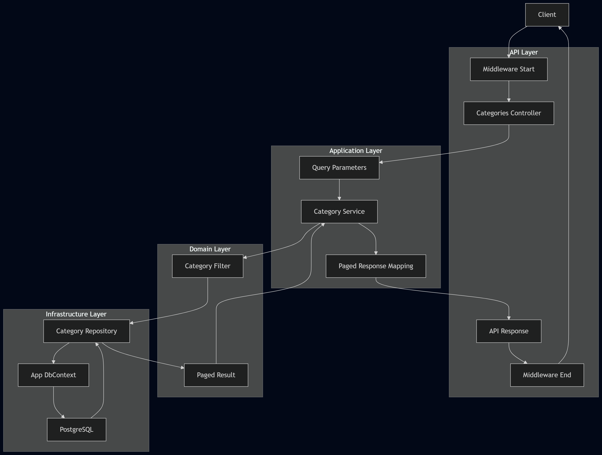
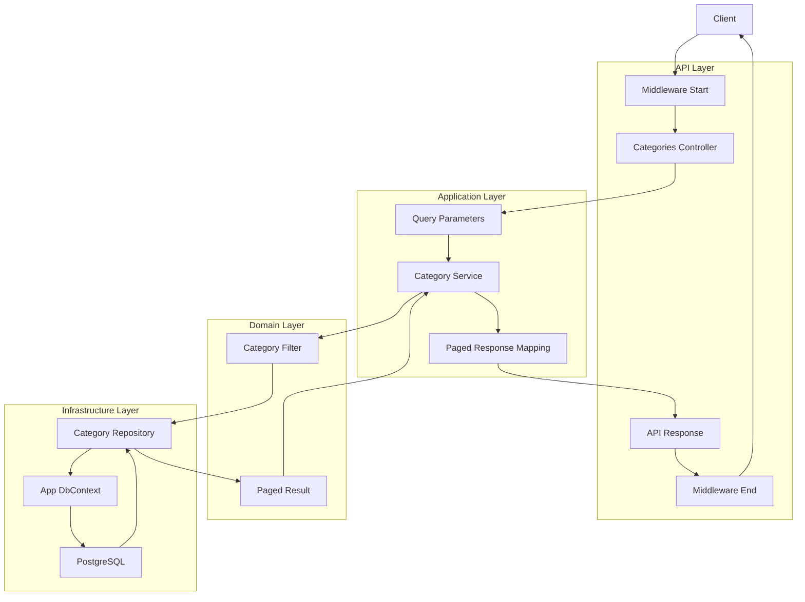
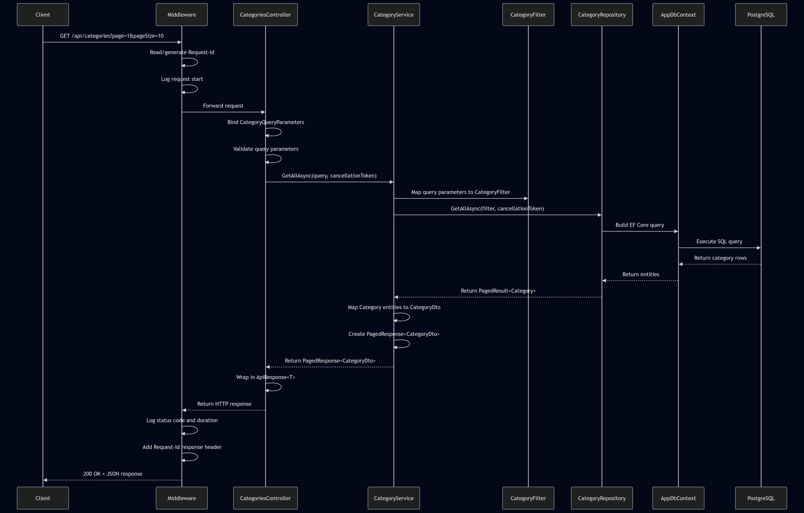
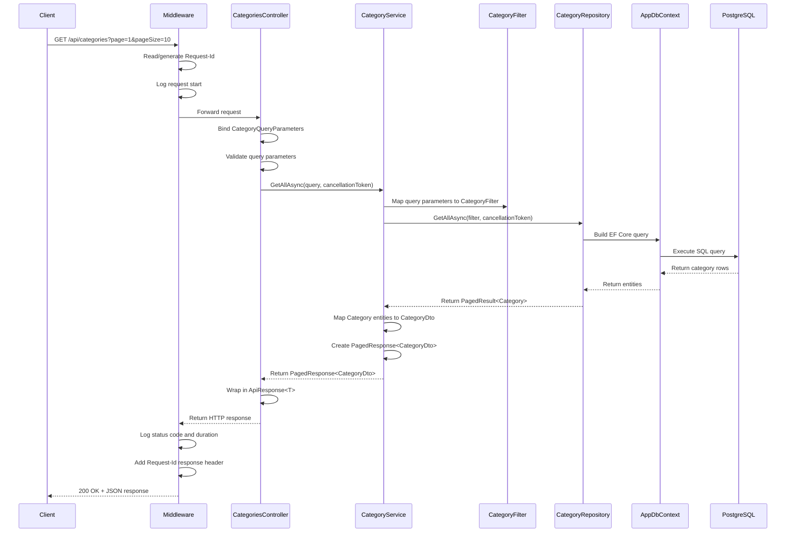

[Docs](../index.md) / [Architecture](./index.md) / [Request Flow](request-flow.md)

# Request Flow

---

This document describes how a request flows through the application, from the client to the database and back.

---

## Flow

A typical request follows this path:

The following diagrams illustrate the request lifecycle across application layers.

### High-Level Flow Diagram

View Mermaid Source

### Sequence Diagram

View Mermaid Source

---

## Step-by-Step Example (Categories)

### 1. Client Request

The client sends a request:

> GET /api/categories

### 2. Middleware  (Request Start)

Middleware processes the request before it reaches the controller.

This includes:

- Generating or reading the `Request-Id`
- Logging request details using Serilog

### 3. Controller (API Layer)

- Receives the HTTP request
- Binds query parameters into `CategoryQueryParameters`
- Model validation runs automatically
    - Invalid requests return a validation response
- Calls the Application service

### 4. Application Service

- Normalizes query parameters (trimming, defaults)
- Maps query parameters → `CategoryFilter`
- Calls the repository layer

### 5. Domain Filter

- Encapsulates filtering, sorting, and pagination rules
- Separates domain logic from API concerns

### 6. Repository (Infrastructure Layer)

- Uses EF Core to build database queries
- Applies filtering, sorting, and pagination
- Executes queries against PostgreSQL
- Returns a `PagedResult<T>`

### 7. Application Mapping

- Maps domain entities → DTOs
- Converts `PagedResult<T>` → `PagedResponse<T>`
- Adds pagination metadata

### 8. API Response Wrapping

- The result is wrapped in `ApiResponse<T>`
- Adds `success`, `message`, `data`, and `errors`

### 9. Middleware (Response End)

After the downstream pipeline completes, control returns to the middleware.

This allows the middleware to:

- Read the final response status code
- Stop the timer and calculate elapsed time
- Log completion details for the request
- Ensure the `Request-Id` is included in the response headers

### 10. Response

- The completed HTTP response is returned to the client

---

## Summary:

- **Middleware** handles cross-cutting concerns (logging, tracing)
- **Controller** handles HTTP + validation
- **Application** handles business logic + mapping
- **Domain** defines rules and filters
- **Infrastructure** executes queries
- **Responses** are standardized and consistent

---

- [Back to top](#request-flow)
- [Back to Architecture Documentation](./index.md)
- [Back to Docs Home](../index.md)